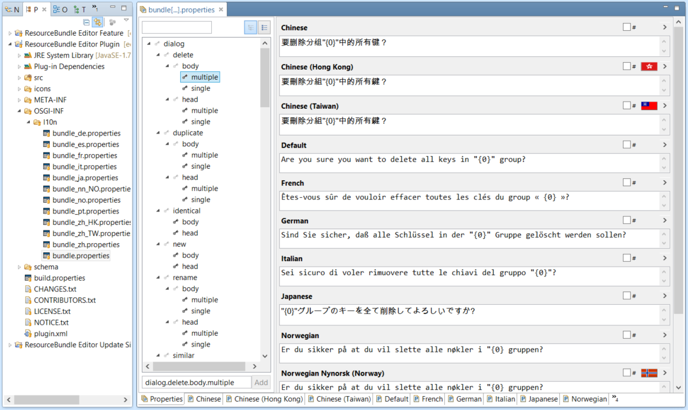

# ResourceBundle Editor

Eclipse plugin for editing Java resource bundles. Lets you manage all localized .properties files in one screen. Some features: sorted keys, warning icons on missing keys/values, conversion to/from Unicode, hierarchical view of keys, and more.

## Use



Go to ResourceBundle Editor web site for more screenshots and other information: http://essiembre.github.io/eclipse-rbe/

## History

Fork of [eclipse-rbe](https://github.com/essiembre/eclipse-rbe) on Github.

## Build

This project uses [Tycho](https://github.com/eclipse-tycho/tycho) with [Maven](https://maven.apache.org/) to build. It requires Maven 3.9.0 or higher version.

Dev build:

```
mvn clean verify
```

Release build:

```
mvn clean org.eclipse.tycho:tycho-versions-plugin:set-version -DnewVersion=2.0.0 verify
```

## Install

1. Add `https://raw.githubusercontent.com/tlcsdm/eclipse-rbe/update_site/` as the upgrade location in Eclipse.
2. Download from [Jenkins](https://jenkins.tlcsdm.com/job/eclipse-plugin/job/eclipse-rbe)
