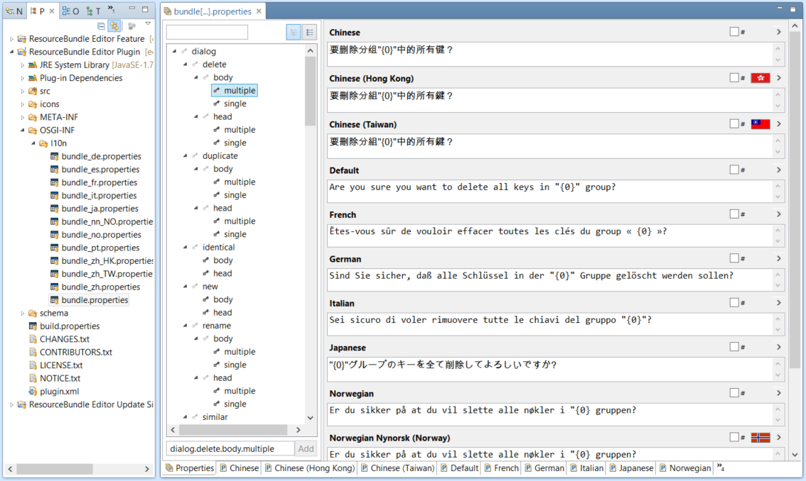

# ResourceBundle Editor

Eclipse plugin for editing Java resource bundles. Lets you manage all localized .properties files in one screen. Some features: sorted keys, warning icons on missing keys/values, conversion to/from Unicode, hierarchical view of keys, and more.

## Use



Go to ResourceBundle Editor web site for more screenshots and other information: http://essiembre.github.io/eclipse-rbe/

## Features / Help

The ResourceBundle Editor lets you edit a family of `*.properties` files (one per locale) as a single resource bundle.

### Editor layout

When you open any `*.properties` file that belongs to a bundle, the plugin opens a multi-page editor:

- **Properties page** – the main page where you edit translations across all locales. From version 1.2.0 it offers two switchable layouts (see below).
- **One source-editor page per locale** – a regular Eclipse text editor for the underlying `.properties` file, useful for low-level editing or reviewing the raw output.
- **New… page** – a wizard-like page that lets you add a new locale to the bundle.

### View mode toggle (1.2.0+)

The Properties page can be rendered in two modes, switched from the toggle buttons at the top of the editor:

- **Form view** *(default)* – the classic layout, with the key tree on the left and a stack of locale-specific value editors on the right. Best for editing one key at a time with full control over comments, similar/duplicate detection, etc.
- **Table view** – a spreadsheet-style layout where each row is a key and each column is a locale. Best for getting an overview of which translations are missing and for quickly editing many cells.

The selected view mode is persisted as a preference, so the editor opens in the same mode the next time you launch Eclipse.

### Other UI elements

- **Key tree (left panel, form view)** – navigate keys hierarchically or flat. The toolbar above the tree allows: add a key, rename, duplicate, delete, comment/uncomment, expand/collapse all, and toggle between flat/hierarchical layout. The filter field lets you search keys; the *incomplete translations* filter hides keys that have all translations filled.
- **Value editors (right panel, form view)** – one text area per locale, with a country flag, similar/duplicate value icons, and a "comment this entry" checkbox.
- **Outline view** – key tree exposed as an Eclipse Outline for navigation.
- **Preferences** (`Window > Preferences > ResourceBundle Editor`) – control formatting, key grouping, key sorting, displayed locales, performance/reporting options, and more.
- **New ResourceBundle wizard** (`File > New > Other… > ResourceBundle`) – create a new bundle with one file per selected locale.

## History

Fork of [eclipse-rbe](https://github.com/essiembre/eclipse-rbe) on Github.

## Build

This project uses [Tycho](https://github.com/eclipse-tycho/tycho) with [Maven](https://maven.apache.org/) to build. It requires Maven 3.9.0 or higher version.

Dev build:

```
mvn clean verify
```

Release build:

```
mvn clean org.eclipse.tycho:tycho-versions-plugin:set-version -DnewVersion=2.0.0 verify
```

## Install

1. Add `https://raw.githubusercontent.com/tlcsdm/eclipse-rbe/update_site/` as the upgrade location in Eclipse.
2. Download from [Jenkins](https://jenkins.tlcsdm.com/job/eclipse-plugin/job/eclipse-rbe)
3. <table style="border: none;">
  <tbody>
    <tr style="border:none;">
      <td style="vertical-align: middle; padding-top: 10px; border: none;">
        <a href='http://marketplace.eclipse.org/marketplace-client-intro?mpc_install=7501942' title='Drag and drop into a running Eclipse Indigo workspace to install eclipse-translation'> 
          
        </a>
      </td>
      <td style="vertical-align: middle; text-align: left; border: none;">
        ← Drag it to your eclipse workbench to install! (I recommand Main Toolbar as Drop Target)
      </td>
    </tr>
  </tbody>
</table>
